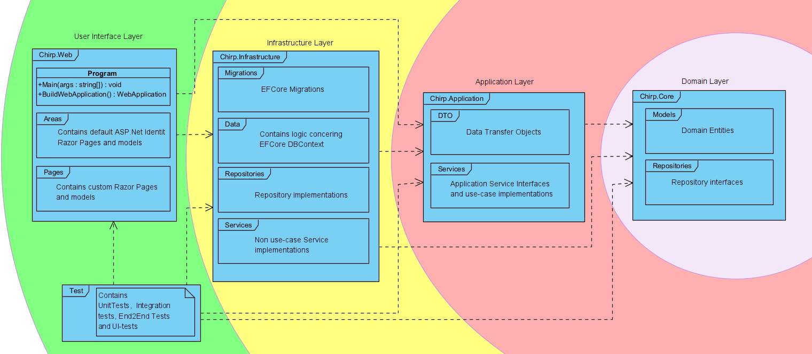
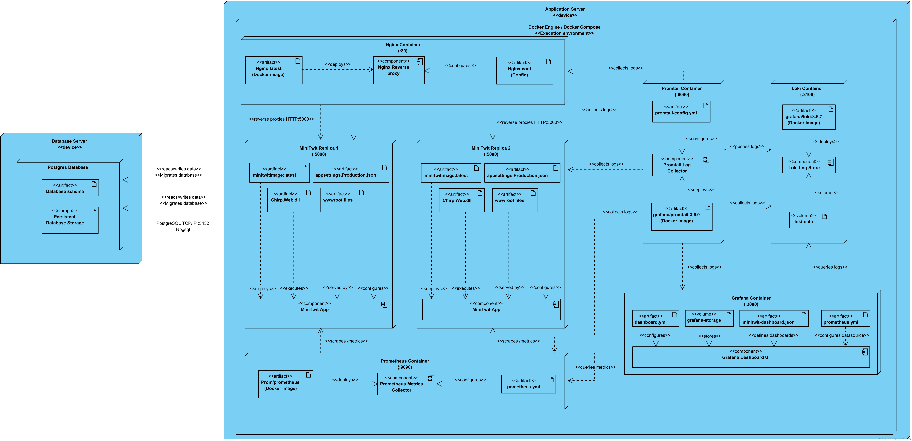
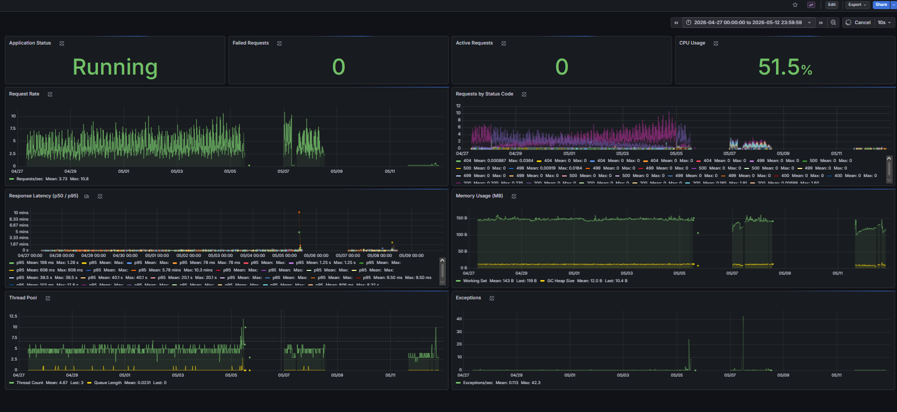
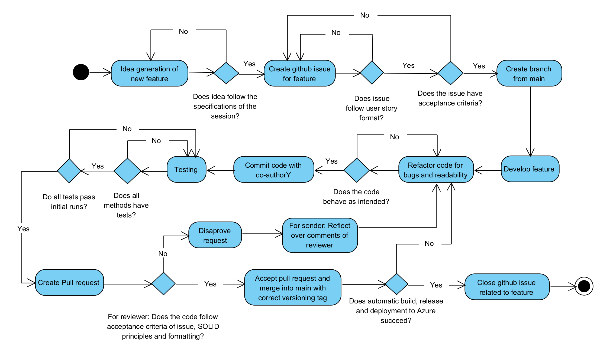
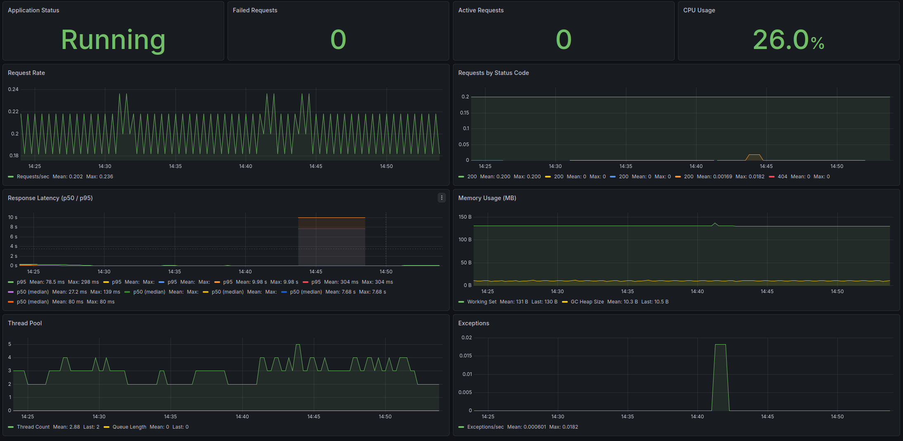

# DevOps Group L Report

# Table of Contents

- [Systems perspective](#systems-perspective)
  - [Design](#design)
  - [Architecture](#architecture)
    - [User Access](#user-access)
  - [Technologies](#technologies)
    - [MiniTwit Application dependencies:](#minitwit-application-dependencies)
    - [Application Server dependencies:](#application-server-dependencies)
    - [CI/CD Dependencies:](#cicd-dependencies)
  - [Current state of system](#current-state-of-system)
- [Process perspective](#process-perspective)
    - [CI/CD Pipeline](#cicd-pipeline)
  - [Monitoring with Grafana](#monitoring-with-grafana)
    - [Infrastructure and integration:](#infrastructure-and-integration)
    - [Known issues:](#known-issues)
  - [Logging with Loki](#logging-with-loki)
    - [Loki architecture](#loki-architecture)
    - [Logging value](#logging-value)
- [Reflection Perspective](#reflection-perspective)
  - [Evolution and refactoring](#evolution-and-refactoring)
  - [ERROR handling](#error-handling)
  - [WHAT DID WE DO DIFFERENTLY](#what-did-we-do-differently)
    - [Database migration and SQLite backup](#database-migration-and-sqlite-backup)
- [Use of Generative AI](#use-of-generative-ai)
- [Report contributions](#report-contributions)
- [Bibliography](#bibliography)

# Systems perspective
## Design
Our Minitwit application initially started as the legacy Python 2 version which we refactored and migrated to Python 3. Afterwards we replaced the original application with our existing Chirp project created from the third semester course "Analysis, Design, and Software Architecture (BDSA)" and refactored it to support the required MiniTwit functionality. This approach, of using an already established project was chosen, because refactoring an existing and maintainable system is often more preferred to refactoring a legacy application with outdated dependencies and it aligned well with the course recommendation regarding software refactoring and reuse of existing systems. 

Replacing the original Python2 (later Python3) MiniTwit application with the Chirp project allowed us to avoid future maintainability and dependency related issues, which is common with legacy systems. Furthermore building upon an already established architecture allowed us to focus more on DevOps related task such as deployment, infrastructure configuration and systems maintenance.

## Architecture

*Figure 1: Onion Structure of the MiniTwit Application*

The MiniTwit application is structured around the Onion Architecture as seen on figure 1. This approach ensures domain and application logic are kept separate from technical concerns such as the web framework, database access, authentication and API configuration. The 'Chirp.Web' part of the project is where the bulk of changes has been made for API controllers, middleware, and session based login.

The application uses EF Core together with ASP.NET Core Identity to handle database and login/user information. On top of Identity, the application uses session based login state for the browser interface. When users logs in, the application stores the user's id in the session. 

MiniTwit API is kept separated from this flow and protected using basic Authentication configured as part of the middleware.

*Figure 2: Deployment Diagram of entire Minitwit System.*

Figure 2 shows the system architecture is relatively simple and distributed across three servers:

* Dedicated database server
* Primary application server
* Backup application server used for failover

The backup application server acts like a standby deployment and receives traffic if the primary application server becomes unavailable.

The primary and backup application servers are containerized using Docker Compose. When the application environment starts, it creates:

* An Nginx reverse proxy container,
* Two MiniTwit application containers running the ASP.NET Core web app.

### User Access

*Figure 3: Nginx distributing requests between two Docker containers using round robin and both querying PostgreSQL Database.*

Figure 3 depicts how a User accesses the system through the Nginx reverse proxy. Nginx forwards incoming HTTP requests to the MiniTwit application containers through Docker’s internal network, and distributing traffic between the two replicas to reduce load on a single container and improve availability.

The system also includes a separate PostgreSQL database server. The MiniTwit application containers are the only services that communicate with the database. Communication is handled by using Entity Framework Core (EF Core) together with the Npgsql PostgreSQL driver. Through this connection, the application is responsible for:

* Reading and writing application data
* Automatically applying EF Core database migrations to maintain the database schema

In addition to the application infrastructure, the system includes a monitoring and logging stack consisting of Prometheus, Promtail, Loki, and Grafana.

Prometheus is responsible for collecting hardware and application metrics, including metrics exposed by the MiniTwit application. Promtail collects logs from all Docker containers running on the application server, and forwards them to Loki. Loki acts as the centralized log storage system, while Grafana provides dashboards and visualization for both Prometheus metrics and Loki logs. Together, these services provide observability into the system’s performance, health, and runtime behavior.

## Technologies
### MiniTwit Application dependencies:
* .NET SDK 8.0.102 targeting net8.0. [[dotnet-sdk]](#dotnet-sdk)
* ASP.NET Core Razor Pages for the web UI and API. [[aspnetcore]](#aspnet-core)
* ASP.NET Core Identity for users, login, registration, account management, and personal data handling. [[aspnetcore]](#aspnet-core)
* Entity Framework Core 8 for persistence and migrations. [[ef-core]](#entity-framework-core)
* PostgreSQL/Npgsql for production style database support for PostgreSQL database servers. [[postgresql]](#postgresql) [[npgsql]](#npgsql)
* xUnit for unit and integration tests. [[xunit]](#xunit)
* NUnit and Playwright for browser UI/end-to-end tests. [[nunit]](#nunit) [[playwright-dotnet]](#playwright-dotnet)
* SQLite for local/legacy fallback and test data. [[sqlite]](#sqlite)

### Application Server dependencies:
* Docker for application packaging. [[docker]](#docker)
* 8.0-jammy-chiseled hardened Docker image. [[dotnet-docker]](#dotnet-docker)
* Docker Compose for service orchestration. [[docker-compose]](#docker-compose)
* Nginx as reverse proxy/load-balancing entry point. [[nginx]](#nginx)
* Vagrant for provisioning the server. [[vagrant]](#vagrant)
* DigitalOcean for hosting Docker containers containing application, and monitoring. [[digitalocean]](#digitalocean-doctl)
* DigitalOcean for hosting PostgreSQL server. [[digitalocean]](#digitalocean-doctl)
* Prometheus for collection metrics from systems and applications. [[prometheus]](#prometheus)
* Promtail for collecting logs from Docker containers. [[loki]](#grafana-loki-and-promtail)
* Loki for storing logs collected from Promtail. [[loki]](#grafana-loki-and-promtail)
* Grafana for querying Loki for logs and Prometheus for metrics, and displaying it on a dashboard site. [[grafana]](#grafana)

### CI/CD Dependencies:
* GitHub Actions for CI/CD. [[github-actions]](#github-actions-runner)
* Codacy for static analysis. [[codacy]](#codacy-analysis-cli)
* Security Code Scan 2019 for security analysis. [[security-code-scan]](#security-code-scan)

## Current state of system
Overall, the system is considered stable. The following warnings, errors, and remaining issues are currently present:
* Running Security Code Scan 2019 using the NuGet package on the MiniTwit application produces zero Security Code Scan specific warnings.
* Running Codacy reports 11 high severity warnings and 1 critical warning.
* Running `dotnet build` produces 39 warnings and 9 errors.
* Running `dotnet test` results in 0 failed tests and 41 passed tests across:
    * Integration tests
    * Unit tests
    * End-to-end/UI tests
* Running `dotnet list package --vulnerable` reports 0 known vulnerabilities across all packages in the solution.

The issues Codacy report are warnings concerning infrastructure and dependency management, such as Docker configurations and third party repositories using latest package versions instead of pinned versions. While these does not currently affect system stability, they could introduce security risks in the future if dependencies become compromised. These issues would therefore be prioritized in a long term development.

*Figure 4: Grafana Dashboard*

Figure 4 shows the Grafana dashboard, which indicates that the ASP.NET system is generally stable and performs well during normal operation. CPU utilization remains at an acceptable level of approximately 50%, and memory usage appears stable without signs of memory leaks or excessive garbage collection activity. Most requests are completed successfully with HTTP 200 responses, while server side errors remain limited.

Response latency is generally low, with most requests completing within milliseconds. However, several incidents occurred with high latency spikes during the observed period, including a few extreme cases where response times increased significantly. These spikes coincide with increased exception activity, suggesting that the system experienced instability under specific conditions in specific periods.

The most significant instability occurred between the 8th and 11th of May. During this period, the system experienced a substantial increase in incoming requests, which caused repeated service crashes and periods of downtime. Although the application was temporarily restored multiple times, it continued shutting down under load. Additionally, the backup server had not been deployed correctly and therefore failed to take over when the primary instance became unavailable.

These issues were presumably caused by a lack of resources on the servers, as they're running multiple containers with only 1GB of ram. We fixed this by adding a swapfile on the server, which is disk space Linux can use like emergency RAM when physical memory runs low. After this was implemented, the server became more responsive, and interactable.

# Process perspective 

*Figure 5: Flow diagram of process from idea to production*

Figure 5 shows how an idea gets to production. When an idea is made, we decide whether it should be a feature. If yes, then we create a feature branch from main, develop the feature, ensure idiomatic code, and create tests. If all tests pass, a pull request is created, and our CI pipeline runs. If review is approved, and CI passes, it is pushed to main, the CD runs, and the feature is pushed to the production environment.

### CI/CD Pipeline

*Figure 6: Flow diagram of CI/CD*

Figure 6 shows our flowdiagram of the CI/CD pipeline on a push to main. Do note that our CI pipeline also gets run on any pull request.

Our CI ensures that our tests passes and our project can be built. It also scans the repository for security vulnerabilities with Semgrep and uploads them to Github.

Our CD pipeline runs after the CI and only if CI passes before being merged in via pull request. It builds the docker images and pushes them to docker hub as well as scanning the image for vulnerabilities. It then uploads deployment and monitoring configuration files to both servers via SSH, and runs the deployment scripts on the server.

Do note that if one step in the pipeline fails, none of the subsequent steps will run.

## Monitoring with Grafana

*Figure 7: Grafana Dashboard*
To monitor our system, we use Grafana, which is shown on Figure 7, integrated using prometheus as our "observer". Grafana serves as our systems health monitor, deployed via our dockerfile it provides live insights into the systems overall health and performance metrics. Prometheus handles metrics collection and short-time storage by scraping data from an endpoint exposed by our application at regular intervals.

### Infrastructure and integration:
* __Prometheus config:__ Our prometheus.yml file defines our scrape targets, including the miniTwit app, and defines a 5 second scrape interval.
* __Grafana Provisioning:__ We use Grafana's standard provisioning system to automatically configure data sources and dashboards on startup. Here the prometheus datasource is defined and connected to port 9090 within our Docker network. Our custom dashboard is provisioned through the file provider which ensures consistent deployment.
* __Dashboard panels:__ Our grafana dashboard tracks important ASP.NET Core metrics including system status, request rates, HTTP status code distribution, response latency, memory usage, thread pool stats, and exception rates, these are all exposed using .NET's built in metric system which includes a standard/metrics endpoint.

### Known issues:
* Grafana allows highly customizable dashboards for monitoring system health, but this flexibility can also introduce configuration issues. We experienced incorrect CPU usage reports, sometimes showing impossible values such as 757% usage. This was likely caused by errors in the dashboard’s JSON configuration or calculation logic.
* Recently our Grafana experience extreme load times and significant performance outages, we suspected something to be wrong with our Grafana setup or the system in general.

## Logging with Loki
For centralized logging, we use Loki, Grafanas's own logging tool. Loki integrates seamlessly with our already existing Grafana setup, requiring very little configuration to our current setup. Once deployed to the system it adds a dedicated logging interface to our Grafana instance where we can watch and analyze logs from our Minitwit.me

### Loki architecture
* __Loki server:__ Our Loki config is configured to listen on port 3100 using a local filesystem for storage. The schema enforces a 7-day maximum age for log retention to prevent storing stale data.
* __Promtail agent:__ We deploy Promtail as a log shipper that watches Docker containers and automatically scrapes logs from said containers. After a scrape pipeline stages are applied to filter out noise, especially for filtering out ASP.NET Cores static file requests and other empty info logs.
* __Grafana integration:__ Once deployed, Loki adds a dedicated interface in Grafana were we can query and watch over logs from the MiniTwit app.

### Logging value
By Logging we ensure that we are provided visibility into incoming requests, including their origin and payload. This is crucial for monitoring traffic, debugging issues, but mostly to be aware of any suspicious requests sent to our system.

# Reflection Perspective
## Evolution and refactoring
As described at the beginning, we chose to base our MiniTwit system on our previous BDSA course project. In hindsight, this was both an advantage and a challenge. 

Our main advantage was we were familiar with C# and .NET technologies and therefore could focus more on DevOps related work like deployment, monitoring, provisioning, and CI/CD. 

The challenge was that the project was a larger and more complex system than the original MiniTwit project. This meant every change required a stronger understanding of the existing architecture.

The most important refactorings were adding a MiniTwit compatible API, improving observability through logging, metrics, and adding session based login on top of ASP.NET Core Identity. These changes taught us that refactoring an existing system for DevOps purposes is not only about adding functionality but also about making the system understandable and operable. For example, the API was necessary for simulator interaction. It also introduced new possibilities for failure which were difficult to debug before we improved logging.

With the addition of containerization for creating the same deployment environment on our local machines, as on the deployed server, accurately bugfixing, and configuring the environment became easier than previously as the environment was now always the same. With automatic CI/CD pipelines and provisioning to a DigitalOcean droplet, the application quickly became a more complex system, where having Grafana displaying logging from the server, became crucial for maintaining the system.

A key lesson from the project is that DevOps improvements often increase system complexity before they improve reliability.

## ERROR handling
When we moved to using PostgreSQL we initially experienced no trouble, after the server was correctly setup, but upon inspection found that API calls did not result in logged errors, but simply got redirected to the /error page, same when a desktop user experiences an error. This means that we were not logging errors, and missed a critical error with the PostrgresQL server not being able to handle timestamps users send with their requests to the server. After updating the logging, such that, API calls log the errors to the console, we were able to follow the error stream, and begin maintaining the server whenever issues arose.

## WHAT DID WE DO DIFFERENTLY

### Database migration and SQLite backup
When migrating from SQLite to PostgreSQL, we integrated a migration step directly into our ASP.NET application. On startup, the system checks whether the bundled SQLite database contains data that is missing from PostgreSQL. If so, a synchronization script automatically transfers the missing data into PostgreSQL.

This approach allowed us to migrate with almost no downtime, since the existing SQLite database file was shipped with the product and could immediately populate the PostgreSQL database when the backend started for the first time.

We also implemented SQLite as a fallback database. If PostgreSQL became unavailable, the application would temporarily use the local SQLite database instead. This could lead to unsynchronized data between Docker replicas, causing users to see different data depending on which replica handled the request. Once PostgreSQL was available again, new SQLite data was automatically migrated back, ensuring eventual consistency. While not ideal, the solution was functional and improved system resilience.

# Use of Generative AI
We used Generative AI throughout the course to support various development and DevOps related activities such as:
* Creating tests
* Creating grafana board
* Sparring when working alone
* Rubber ducking when trying to find bugs
* Project research
* Script creation (part of vagrant provisioning as well as for the rsync parts in the pipelines for idempotency.)
* Refactoring assistance and codebase exploration

The AI tools used throughout the project was Claude code, ChatGPT, and Codex.

Generative AI has mostly been useful for understanding unfamiliar concepts, various debugging issues, and accelerating smaller development tasks. 

However, the use of Generative AI also introduced challenges during the initial setup of automatic provisioning. We experienced difficulties configuring Vagrant to automatically ssh into the DigitalOcean droplet using a stored ssh key for this purpose. With the help of our TA we eventually identified that the issue which related to storing SSH keys in github secrets. 

# Report contributions
* Alfred(alfd):  
    * Reflection - Database migration & SQLite backup.
* Noah (noav): 
    * System Perspective - Architecture, 
    * System Perspective - Technologies
    * System Perspective - Current state of system
    * Process Overview - Intro section
    * Process Overview - CI/CD Pipeline
* Alfred (aold): 
    * Process Overiew - Monitoring with Grafana
    * Process Overiew - Logging with Loki
* Yasmin (yasn)
    * System Perspective - Design
    * Reflection - Evolution and refactoring
    * Reflection - Use of Generative AI
* Peter (praa):
    * Systems perspective - Design
    * Process Overview - Error Handling
    * Reflection - Use of Generative AI
    * Reflection - Evolution and refactoring
    * Readme of Project & Creation of Videos

# Bibliography

## .NET SDK
Microsoft. ".NET SDK." GitHub repository. Available at: https://github.com/dotnet/sdk

## ASP.NET Core
Microsoft. "ASP.NET Core." GitHub repository. Available at: https://github.com/dotnet/aspnetcore

## Entity Framework Core
Microsoft. "Entity Framework Core." GitHub repository. Available at: https://github.com/dotnet/efcore

## PostgreSQL
PostgreSQL Global Development Group. "PostgreSQL." GitHub mirror of the official Git repository. Available at: https://github.com/postgres/postgres

## Npgsql
Npgsql. "Npgsql." GitHub repository. Available at: https://github.com/npgsql/npgsql

## xUnit
xUnit.net. "xUnit.net." GitHub repository. Available at: https://github.com/xunit/xunit

## NUnit
NUnit. "NUnit Framework." GitHub repository. Available at: https://github.com/nunit/nunit

## Playwright .NET
Microsoft. "Playwright for .NET." GitHub repository. Available at: https://github.com/microsoft/playwright-dotnet

## SQLite
SQLite. "SQLite." Official Git mirror of the SQLite source tree. Available at: https://github.com/sqlite/sqlite

## Docker
Docker. "Docker." GitHub repository for the open-source container engine. Available at: https://github.com/docker

## .NET Docker
Microsoft. ".NET Docker images." GitHub repository. Available at: https://github.com/dotnet/dotnet-docker

## Docker Compose
Docker. "Docker Compose." GitHub repository. Available at: https://github.com/docker/compose

## Nginx
F5 NGINX. "NGINX Open Source." GitHub repository. Available at: https://github.com/nginx/nginx

## Vagrant
HashiCorp. "Vagrant." GitHub repository. Available at: https://github.com/hashicorp/vagrant

## DigitalOcean
DigitalOcean. DigitalOcean.com. Available at: https://www.digitalocean.com

## Prometheus
Prometheus. "Prometheus." GitHub repository. Available at: https://github.com/prometheus/prometheus

## Grafana Loki and Promtail
Grafana Labs. "Loki." GitHub repository containing Loki and Promtail. Available at: https://github.com/grafana/loki

## Grafana
Grafana Labs. "Grafana." GitHub repository. Available at: https://github.com/grafana/grafana

## GitHub Actions Runner
GitHub. "GitHub Actions Runner." GitHub repository. Available at: https://github.com/actions/runner

## Codacy Analysis
Codacy. "Codacy Analysis." Codacy.com. Available at: https://www.codacy.com

## Security Code Scan
Security Code Scan. "Security Code Scan." GitHub repository. Available at: https://github.com/security-code-scan/security-code-scan
